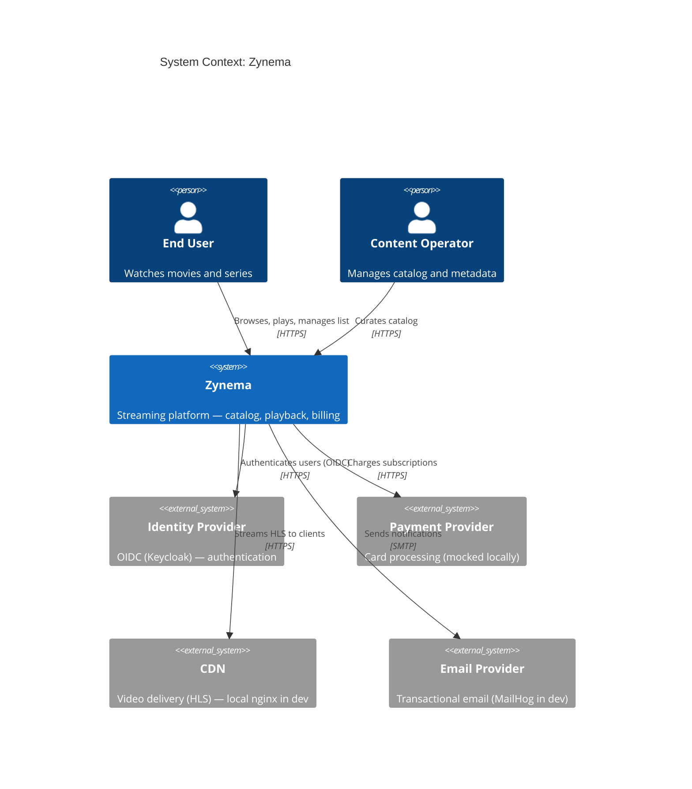

# C4 — Level 1: System Context

Zynema is a streaming platform. It serves two main kinds of users:
**end-users** (who watch content) and **operators** (who manage the catalog).

## Key takeaways

- Zynema is a single **system** in C4 Level 1.
- All external systems (Keycloak, Stripe, MailHog, etc.) are modeled as
  **System_Ext** because they are not part of Zynema itself.
- The operator is included because content management is part of the
  product surface, not just a back-office DB tool.
