# C4 — Level 2: Containers

The Zynema system decomposes into a set of independently deployable
containers. Most are Spring Boot services; the frontend is a Vite SPA.

```mermaid
C4Container
    title Container Diagram: Zynema

    Person(endUser, "End User", "")
    Person(operator, "Content Operator", "")

    System_Boundary(zynema, "Zynema") {
        Container(spa, "Web SPA", "Vite + React + TypeScript", "User-facing UI")
        Container(gateway, "API Gateway", "Spring Cloud Gateway (WebFlux)", "Routes /api/** to backend services")

        Container(bff, "BFF Service", "Spring Boot 3.5 + WebClient", "Aggregates responses for the SPA")
        Container(auth, "Auth Service", "Spring Boot 3.5", "Resource server validating JWT")
        Container(user, "User Service", "Spring Boot 3.5 + JPA", "Profiles, preferences")
        Container(catalog, "Catalog Service", "Spring Boot 3.5 + JPA", "Movies, series, metadata")
        Container(payment, "Payment Service", "Spring Boot 3.5 + JPA + Kafka", "Subscriptions, payments, idempotency")
        Container(playback, "Playback Service", "Spring Boot 3.5 + JPA + Kafka", "Sessions, signed URLs, event sourcing")
        Container(notif, "Notification Service", "Spring Boot 3.5 + JPA + Kafka", "Email, push")

        ContainerDb(catalogDb, "Catalog DB", "PostgreSQL 16", "Catalog data")
        ContainerDb(userDb, "User DB", "PostgreSQL 16", "Profiles, preferences")
        ContainerDb(paymentDb, "Payment DB", "PostgreSQL 16", "Subscriptions, transactions")
        ContainerDb(playbackDb, "Playback DB", "PostgreSQL 16", "Sessions, event store")
        ContainerDb(authDb, "Auth DB", "PostgreSQL 16", "Auth audit, sessions")
        ContainerDb(notifDb, "Notification DB", "PostgreSQL 16", "Delivery state")

        ContainerDb(redis, "Cache", "Redis 7", "Reactive cache, idempotency, rate-limit")
        Container(kafka, "Event Bus", "Kafka 3.7 (KRaft)", "Async events between services")

        Container(eureka, "Service Registry", "Eureka Server", "Service discovery")
        Container(config, "Config Server", "Spring Cloud Config", "Centralized config (Git-backed)")
    }

    System_Ext(keycloak, "Keycloak", "OIDC IdP")
    System_Ext(minio, "MinIO / S3", "Object storage")
    System_Ext(nginx, "Nginx (HLS)", "HLS segment serving")
    System_Ext(mail, "MailHog / SMTP", "Email (dev)")

    Rel(endUser, spa, "Uses", "HTTPS")
    Rel(operator, spa, "Uses", "HTTPS")
    Rel(spa, gateway, "All API calls", "HTTPS")
    Rel(gateway, bff, "/api/v1/web/**", "WebFlux")
    Rel(gateway, auth, "JWT validation", "HTTPS")
    Rel(bff, user, "Aggregates", "WebClient")
    Rel(bff, catalog, "Aggregates", "WebClient")
    Rel(bff, playback, "Aggregates", "WebClient")
    Rel(auth, keycloak, "Validates JWT", "OIDC")

    Rel(catalog, catalogDb, "Reads/writes", "JDBC")
    Rel(user, userDb, "Reads/writes", "JDBC")
    Rel(payment, paymentDb, "Reads/writes", "JDBC")
    Rel(playback, playbackDb, "Reads/writes", "JDBC")
    Rel(notif, notifDb, "Reads/writes", "JDBC")

    Rel(payment, kafka, "Publishes events", "Kafka")
    Rel(playback, kafka, "Publishes events", "Kafka")
    Rel(notif, kafka, "Consumes events", "Kafka")

    Rel(catalog, redis, "Cache", "Redis")
    Rel(bff, redis, "Aggregate cache", "Redis (cache)")

    Rel(playback, minio, "Reads HLS", "S3 API")
    Rel(playback, nginx, "Signed URLs", "HTTPS")
    Rel(notif, mail, "SMTP", "SMTP")

    Rel(eureka, gateway, "Discovery")
    Rel(config, gateway, "Config")
```

## Topology summary

- **Single SPA**, **one gateway**, **one BFF**, **one auth service**, and
  **6 domain services** (user, catalog, payment, playback, notification, plus
  the bff that doubles as a read-side aggregator).
- **6 PostgreSQL databases** (one per service, **database per service**).
- **Redis** for reactive cache + idempotency.
- **Kafka** as the event bus.
- **Eureka + Config** for the Spring Cloud operational layer.

## Why this shape

- **API Gateway** as the only externally exposed Java service keeps the
  attack surface small and the auth story simple.
- **BFF** is the only one the SPA talks to in steady state — domain
  services don't expose public endpoints.
- **DB per service** is enforced from day 1 (ADR-0003). There is no
  shared DB.
- **Kafka** is the only way services communicate asynchronously
  (cross-service reads go through OpenFeign, not event replay).
