# C4 — Level 2: Containers

The Zynema system decomposes into a set of independently deployable
containers. Most are Spring Boot services; the frontend is a Vite SPA, the
video pipeline is a one-shot worker, and the observability stack is part of
the system, not a bolt-on.

```mermaid
C4Container
    title Container Diagram: Zynema

    Person(endUser, "End User", "")
    Person(operator, "Content Operator", "")

    System_Boundary(zynema, "Zynema") {
        Container(spa, "Web SPA", "Vite + React + TypeScript", "Every screen; talks only to the BFF through the gateway")
        Container(gateway, "API Gateway", "Spring Cloud Gateway (WebFlux)", "Routing, rate limiting; the only public Java entry point")
        Container(bff, "BFF Service", "Spring Boot 3.5 + WebClient", "Composes every screen under /api/v1/web/** (ADR-0021)")
        Container(auth, "Auth Service", "Spring Boot 3.5", "Token endpoints and resource-server configuration")
        Container(user, "User Service", "Spring Boot 3.5 + JPA", "Accounts, profiles, watchlist; Keycloak admin for saga roles")
        Container(catalog, "Catalog Service", "Spring Boot 3.5 + JPA", "Content, projected read model, HLS paths")
        Container(payment, "Payment Service", "Spring Boot 3.5 + JPA + Kafka", "Plans, subscriptions, outbox, saga orchestration")
        Container(playback, "Playback Service", "Spring Boot 3.5 + JPA + Kafka", "Event-sourced sessions, signed HLS URLs")
        Container(notif, "Notification Service", "Spring Boot 3.5 + JPA + Kafka", "Contacts projection, email, dead letters")
        Container(worker, "Video Worker", "Java one-shot + FFmpeg", "Transcodes a source into the HLS ladder and imports it")

        ContainerDb(catalogDb, "Catalog DB", "PostgreSQL 16", "Catalog data and read model")
        ContainerDb(userDb, "User DB", "PostgreSQL 16", "Accounts, profiles, outbox")
        ContainerDb(paymentDb, "Payment DB", "PostgreSQL 16", "Subscriptions, outbox, saga state")
        ContainerDb(playbackDb, "Playback DB", "PostgreSQL 16", "Session events, snapshots, projection")
        ContainerDb(authDb, "Auth DB", "PostgreSQL 16", "Auth audit")
        ContainerDb(notifDb, "Notification DB", "PostgreSQL 16", "Contacts, delivery log, dead letters")

        ContainerDb(redis, "Cache", "Redis 7", "Screen cache, idempotency keys, rate-limit buckets")
        Container(kafka, "Event Bus", "Kafka (Confluent 7.6, KRaft)", "Domain events and saga commands")
        Container(schemaRegistry, "Schema Registry", "Confluent", "One JSON Schema per record type (ADR-0025)")
        Container(storage, "Object Storage", "MinIO (S3 API)", "Source videos and HLS renditions")
        Container(hlsEdge, "HLS Edge", "nginx", "Serves the signed segments to the player (ADR-0024)")
        Container(observability, "Observability", "Prometheus, Grafana, Loki, Tempo, Alertmanager", "Metrics, logs, traces, alerts (ADR-0031)")

        Container(eureka, "Service Registry", "Eureka Server", "Service discovery")
        Container(config, "Config Server", "Spring Cloud Config", "Shared configuration served from the repo")
    }

    System_Ext(keycloak, "Keycloak", "OIDC IdP (realm zynema)")
    System_Ext(mail, "MailHog / SMTP", "Transactional email (dev)")

    Rel(endUser, spa, "Uses", "HTTPS")
    Rel(operator, spa, "Uses", "HTTPS")
    Rel(spa, gateway, "All API calls", "HTTPS")
    Rel(gateway, bff, "/api/v1/web/**", "WebFlux")
    Rel(gateway, auth, "Token + public APIs", "HTTPS")
    Rel(gateway, user, "Self-service APIs", "HTTPS")
    Rel(gateway, catalog, "Public catalog APIs", "HTTPS")
    Rel(bff, user, "Accounts, profiles, watchlist", "WebClient")
    Rel(bff, catalog, "Content, browse, search", "WebClient")
    Rel(bff, payment, "Plans, subscription, entitlements", "WebClient")
    Rel(bff, playback, "Session lifecycle, stream paths", "WebClient")
    Rel(auth, keycloak, "Validates JWTs", "OIDC")
    Rel(user, keycloak, "Grants realm roles", "Admin API")

    Rel(catalog, catalogDb, "Reads/writes", "JDBC")
    Rel(user, userDb, "Reads/writes", "JDBC")
    Rel(payment, paymentDb, "Reads/writes", "JDBC")
    Rel(playback, playbackDb, "Reads/writes", "JDBC")
    Rel(notif, notifDb, "Reads/writes", "JDBC")

    Rel(payment, kafka, "Events + commands (outbox)", "Kafka")
    Rel(playback, kafka, "Session events (outbox)", "Kafka")
    Rel(user, kafka, "UserRegistered, RoleGranted", "Kafka")
    Rel(notif, kafka, "Consumes events and commands", "Kafka")
    Rel(kafka, schemaRegistry, "Validates schemas", "HTTP")

    Rel(playback, storage, "Reads renditions", "S3 API")
    Rel(hlsEdge, storage, "Proxies signed segments", "S3 API")
    Rel(spa, hlsEdge, "Plays HLS", "HTTPS")
    Rel(worker, storage, "Uploads the ladder", "S3 API")
    Rel(worker, catalog, "Reports the HLS path", "HTTP")
    Rel(notif, mail, "Sends email", "SMTP")

    Rel(catalog, redis, "Caches reads", "Redis")
    Rel(bff, redis, "Caches screens", "Redis")
    Rel(gateway, redis, "Rate-limit buckets", "Redis")
    Rel(eureka, gateway, "Discovery")
    Rel(config, gateway, "Config")
```

## Topology summary

- **One SPA** behind **one gateway**; the **BFF is the only surface the SPA
  calls** in steady state (ADR-0021).
- **8 Spring services** (gateway, BFF, auth, user, catalog, payment, playback,
  notification) plus a **one-shot video worker**.
- **6 PostgreSQL databases**, one per stateful service (ADR-0003).
- **Redis** for cache, idempotency and rate limiting.
- **Kafka + Schema Registry** as the only asynchronous path; every producer
  writes through its outbox (ADR-0025, ADR-0026).
- **MinIO + nginx edge** deliver video: manifests through playback, segments
  signed and proxied (ADR-0024).
- **Eureka + Config** for the Spring Cloud operational layer.
- **Prometheus, Grafana, Loki, Tempo and Alertmanager** observe all of it; the
  SPA's client is generated from the BFF's OpenAPI document (ADR-0030).

## Why this shape

- **API Gateway** as the only externally exposed Java service keeps the attack
  surface small and the auth story simple.
- **BFF** owns the screen view models so the SPA never orchestrates services.
- **DB per service** is enforced from day 1 (ADR-0003). There is no shared DB.
- **Kafka** carries events and commands; synchronous cross-service reads go
  through OpenFeign, never through event replay.
- **The worker is a job, not a service**: transcoding is burst work with no
  idle cost (ADR-0023).
