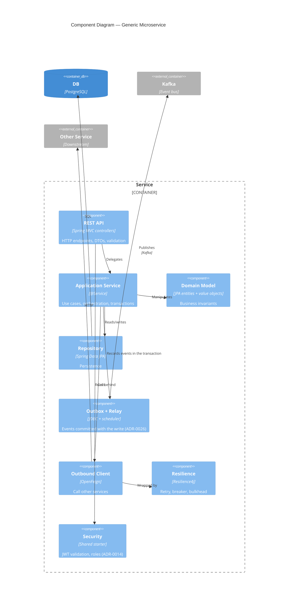
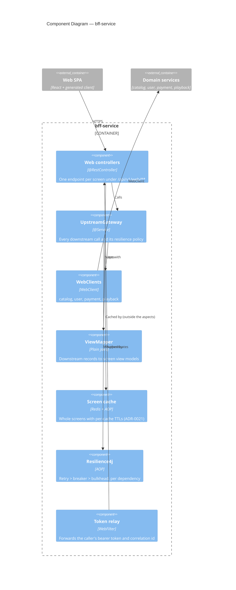
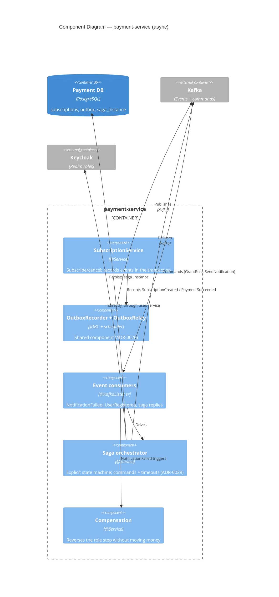

# C4 — Level 3: Components (selected)

Most services follow the same shape; the non-obvious ones get their own
diagram. The learning notes go deeper where the pattern deserves it
(`docs/learning/event-sourcing.md`, `docs/learning/saga-pattern.md`).

## Generic microservice shape

## BFF (the SPA's only surface)

## Payment: outbox, saga and the read side

## Service-specific component diagrams

- [x] bff-service (above)
- [x] payment-service (async paths, above)
- [x] playback-service — the event-sourced session lives in
      [`docs/learning/event-sourcing.md`](../learning/event-sourcing.md)
      (append-only log, fold, snapshots, projection)
- [x] the saga styles live in
      [`docs/learning/saga-pattern.md`](../learning/saga-pattern.md) and
      [ADR-0029](../adr/0029-orchestrated-saga-comparison.md)
- [ ] catalog-service, user-service, auth-service, notification-service:
      the generic shape above is their diagram; the unique pieces are the read
      model projection (ADR-0022), the Keycloak admin client and the contacts
      projection (ADR-0028) respectively.
