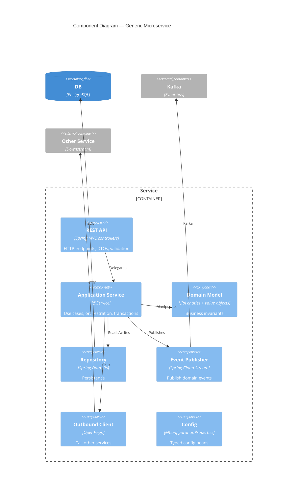

# C4 — Level 3: Components (selected)

This level is fleshed out **per service** as we implement them. Below is the
generic shape that all services follow. Use the service-specific docs in
`backend/<service>/README.md` (when added) for the unique pieces.

## Generic microservice shape

## Patterns used across services

| Concern | Where it lives |
|---|---|
| HTTP entry point | `api` package |
| Use cases | `service` or `application` package |
| Domain rules | `domain` package (entities + value objects) |
| Persistence | `repository` package (Spring Data) |
| Outbound HTTP | `client` package (OpenFeign interfaces) |
| Outbound events | `events` package (Stream producers) |
| Cross-cutting config | `config` package |

## Service-specific component diagrams (TODO)

- [ ] catalog-service
- [ ] payment-service
- [ ] playback-service
- [ ] bff-service
- [ ] user-service
- [ ] auth-service
- [ ] notification-service
